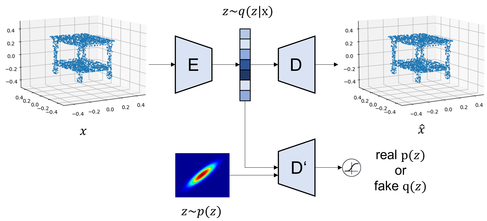
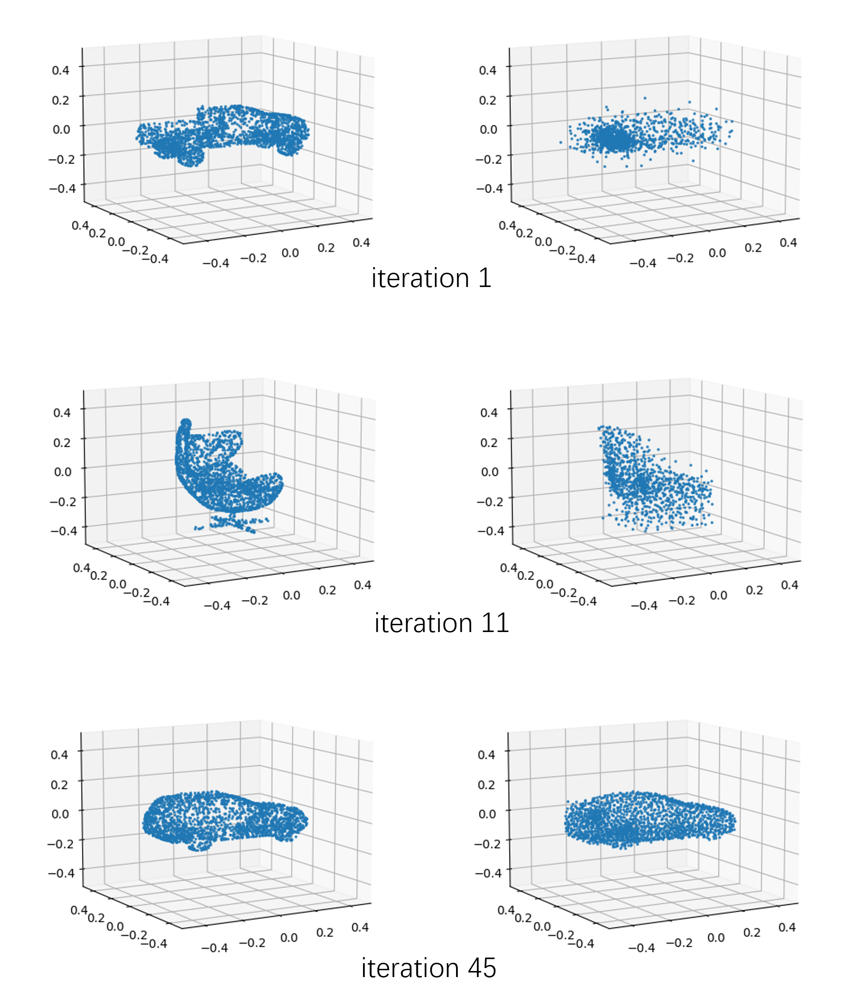
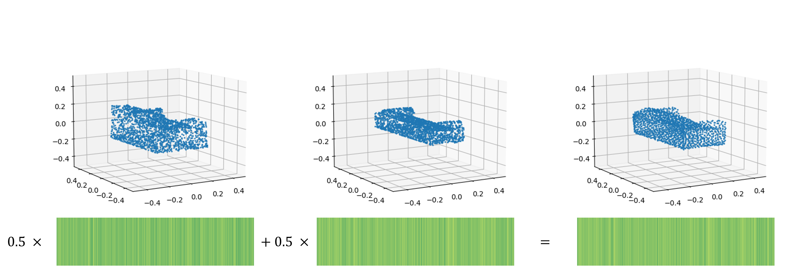

<!--
 * @Date: 2022-03-06 10:53:36
 * @LastEditors: yuhhong
 * @LastEditTime: 2022-04-25 12:52:09
-->
# PointAAE

In this project, we try to edit the latent representation of PointAAE and generate new reasonable point clouds from the operated latent representation. 



## Setup

```bash
conda create -n pointaae python=3.6
conda activate pointaae

# Please check the PyTorch version: 
conda install pytorch torchvision torchaudio cudatoolkit=11.3 -c pytorch
# All the other requirements are in: 
pip install -r requirements.txt
```

## Train

```bash
# Please check the settings, especially the cuda and gpu. 
python train_aae.py --config ./settings/init_exp.json
```

A visualization of reconstruction during training:



## Eval

```bash
python eval_aae.py --config ./settings/init_exp.json
```

We are expected to train it for more than 2000 epochs as the author did in the paper, but it crashed after 400 iterations. Let's find out what happened. 

```bash
2022-04-25 12:06:05,489: DEBUG    Evaluating JensenShannon divergences on validation set on all saved epochs.
2022-04-25 12:06:05,490: DEBUG    Testing epochs: [50, 100, 150, 200, 250, 300, 350, 400, 450]
2022-04-25 12:06:06,159: DEBUG    Device variable: cuda
2022-04-25 12:06:06,159: DEBUG    Current CUDA device: 0
2022-04-25 12:06:07,179: DEBUG    Selected all classes. Loaded 2870 samples.
2022-04-25 12:08:45,067: DEBUG    Epoch: 450 JSD:  0.653789 Time: 0:02:33.634625
2022-04-25 12:11:20,719: DEBUG    Epoch: 400 JSD:  0.655928 Time: 0:02:35.586871
2022-04-25 12:13:54,555: DEBUG    Epoch: 350 JSD:  0.657119 Time: 0:02:33.597101
2022-04-25 12:16:34,994: DEBUG    Epoch: 300 JSD:  0.663368 Time: 0:02:40.202922
2022-04-25 12:19:15,950: DEBUG    Epoch: 250 JSD:  0.663630 Time: 0:02:40.750014
2022-04-25 12:21:59,826: DEBUG    Epoch: 200 JSD:  0.649842 Time: 0:02:43.644191
2022-04-25 12:24:40,552: DEBUG    Epoch: 150 JSD:  0.656921 Time: 0:02:40.529231
2022-04-25 12:27:14,297: DEBUG    Epoch: 100 JSD:  0.666355 Time: 0:02:33.505640
2022-04-25 12:29:49,034: DEBUG    Epoch: 50 JSD:  0.663614 Time: 0:02:34.500206
2022-04-25 12:29:49,043: DEBUG    Minimum JSD at epoch 200:  0.649842
```

## Edit

```bash
python edit_aae.py --config ./settings/init_exp.json --epoch 400
```

A visualization of editing (sum two embedded vectors): 



## References:

- https://github.com/MaciejZamorski/3d-AAE

- https://github.com/AnTao97/dgcnn.pytorch