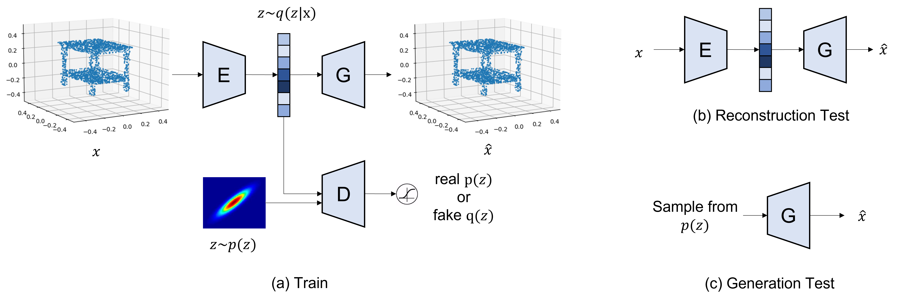

<!--
 * @Date: 2022-03-06 10:53:36
 * @LastEditors: yuhhong
 * @LastEditTime: 2022-05-03 22:06:19
-->
# B659 Experiments on 3dAAE

This is the final project of CSCI-B659 Computer Vision, Indiana University. In this project, we try to edit the latent representation of PointAAE and generate new reasonable point clouds from the operated latent representation. 



## Setup

```bash
conda create -n pointaae python=3.6
conda activate pointaae

# Please check the PyTorch version: 
conda install pytorch torchvision torchaudio cudatoolkit=11.3 -c pytorch
# All the other requirements are in: 
pip install -r requirements.txt

# -----------------------------------------------------------------------
# The following package is only compatible to CUDA 10.0. If your cuda's 
# version != 10.0, please DO NOT install the following package. 
# You could compute the metric slowly with cpu, or you could chooes not to 
# comput MMD-CD and MMD-EMD. 
# The metrics are setted in `./settings/*.json:"metrics":["jsd", "mmd"]`.
# -----------------------------------------------------------------------
# Compile CUDA kernel for CD/EMD loss
root=`pwd`
cd metrics/pytorch_structural_losses/
make clean
make
cd $root
```

## Train

```bash
# Please check the settings, especially the cuda and gpu. 
python train_aae.py --config ./settings/init_exp.json

python train_aae.py --config ./settings/dgcnn_enc_exp.json
```

A visualization of reconstruction during training:


## Eval

We didn't implement the results in the paper. It is expected to train the model for more than 2000 epochs as the authors did in the paper, but it crashed after 400 iterations. 

```bash
> python eval_aae.py --config ./settings/init_exp.json

2022-05-01 20:11:36,854: DEBUG    Minimum generation JSD at epoch 95:  0.674413
2022-05-01 20:11:36,854: DEBUG    Minimum reconstruction JSD at epoch 100:  0.062147
```

```bash
> python eval_aae.py --config ./settings/dgcnn_enc_exp.json

2022-05-01 12:38:27,899: DEBUG    Minimum generation JSD at epoch 40:  0.689431
2022-05-01 12:38:27,900: DEBUG    Minimum reconstruction JSD at epoch 85:  0.167931
```


## Edit

```bash
python edit_aae.py --config ./settings/init_exp.json --epoch 400
```

A visualization of editing (sum two embedded vectors): 


## References:

Our experiments are mainly based on the following codebases. We gratefully thank the authors for their wonderful works.

- https://github.com/MaciejZamorski/3d-AAE

- https://github.com/AnTao97/dgcnn.pytorch

- https://github.com/stevenygd/PointFlow